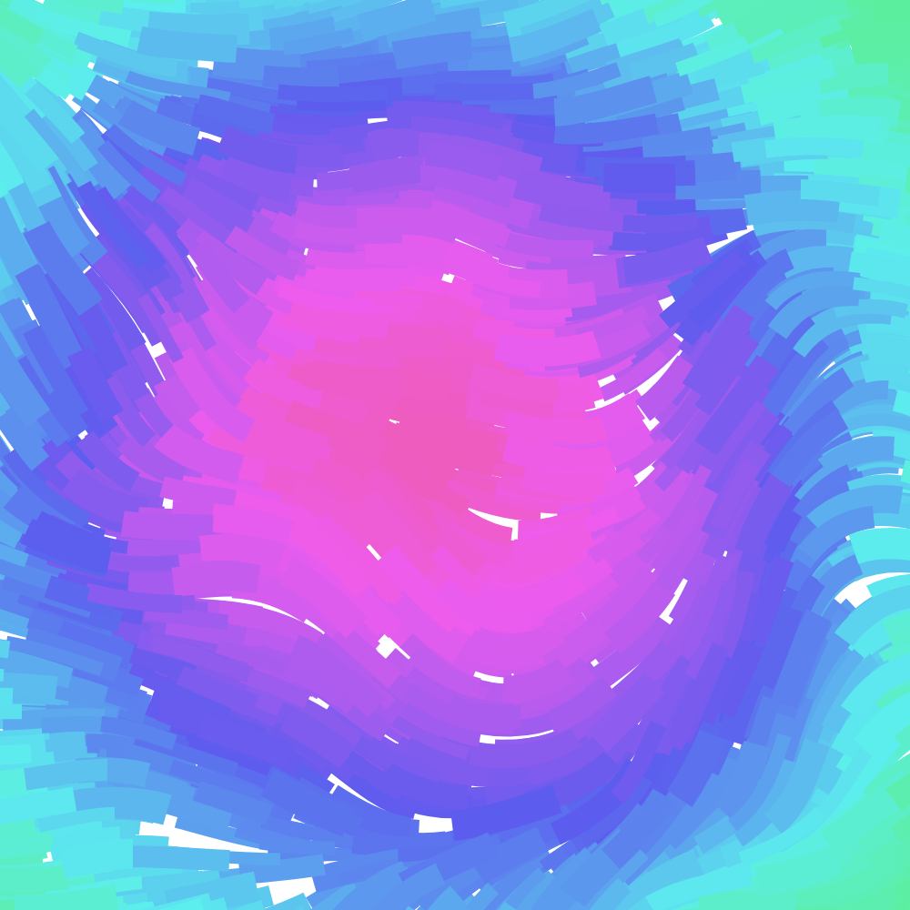

# Generative Flow

Generative art inspired by Tyler Hobb's [Fidenza](https://tylerxhobbs.com/fidenza). Uses perlin noise to create flow lines, and draws bezier curves on top, along with features for how to color them, how to split them up, etc.

`automate.py` runs the script many times to generate multiple generative art pieces. Some of my favorites that were generated:

|   |  |  | 
| --- | --- | --- |
|   |  |  | 
|   |  |  | 
|   |  |  | 
|   |  |  | 
|   |  |  | 
